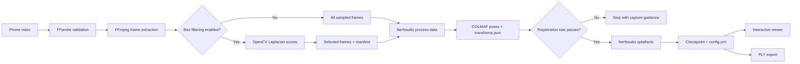

# Architecture

## Purpose

Room Reconstruction is a thin, testable Python orchestration layer around proven
computer-vision tools. It does not implement Structure-from-Motion or Gaussian
splatting itself. It validates inputs, selects and invokes the external tools,
checks their outputs, records state, and stops early when a run is unlikely to
succeed.

## Data flow

## Owned code and external systems

| Component | Responsibility |
| --- | --- |
| `video.py` | Validate the input and parse FFprobe metadata. |
| `frame_quality.py` | Score blur, select frames, and write the quality manifest. |
| `pipeline.py` | Manage stages, resume behavior, quality gates, logs, and metadata. |
| `config.py` | Load and strictly validate reproducible YAML presets. |
| `export.py` | Locate a completed checkpoint and invoke the Nerfstudio exporter. |
| FFmpeg / FFprobe | Decode the video and sample images. |
| COLMAP via Nerfstudio | Match features and estimate camera poses. |
| Nerfstudio / PyTorch | Optimize and render the Gaussian-splat scene. |

## Run state and failure handling

Every run writes `metadata.json` atomically. Its status moves through `running`,
`completed`, `failed`, `interrupted`, or `dry_run`, and each stage records its own
status and timestamp. `processing.log` preserves commands and major decisions.

A normal run refuses to reuse an output directory containing reconstruction
artifacts. `--resume` is explicit: it reuses extracted frames, existing camera
poses, and a completed checkpoint when present. Camera registration is checked
before GPU optimization; a rate below the configured minimum fails with advice
to recapture with more overlap, parallax, and less blur.

## Design decisions

- Sequential matching is the default because frames come from an ordered video.
- Blur filtering is opt-in. On the first evaluated room it removed frames but did
  not improve reconstruction metrics, so enabling it by default is not justified.
- The low-memory preset trades speed and final detail for a quicker, lower-pressure
  preview using fewer frames, fewer iterations, half-resolution cameras, and CPU
  image caching.
- Large inputs and generated artifacts stay outside Git; the repository contains
  code, configuration, tests, and small documentation assets only.
